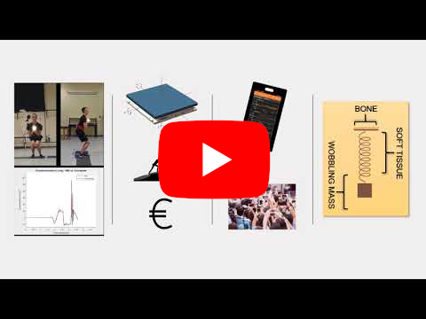

# Smartphone-Based Democratization of Jump Height Estimate

This small and humble repository has been created to show the core processing of what have been made for the ISB2021 abstract entitled *Smartphone-Based Democratization of Jump Height Estimate*. 

Smartphones are devices within everyone's reach, which IMUs can be exploited to accomplish many goals. Our goal was to optimize (I should say *to correct*) jump height estimates. 

The idea was to combine both **antropometric** and **time-frequency features**.

<p align="center"><kbd><a href = "http://www.youtube.com/watch?v=Zc1udsMlZv0">
   </a> </kbd>
</p>

In this repository, you will find an *interactive* Python Notebook. If you are familiar with what such an environment is, just clone the repository and feel free to play with the code. If not, you can either install <a href = "https://www.python.org/">Python</a> (and <a href = "https://jupyter.org/">Jupyter</a>) on your device, or clone it directly on your Google Drive cloud storage via <a href = "https://colab.research.google.com/">Colab</a>. Enjoy!

## Data Description

- ```./main.ipynb``` The main file, containing code and explanation;
- ```./data/cmj_smartphone.csv``` Measures coming from the smartphone IMU (acc and gyr) of a sample Countermovement jump;
- ```./data/cmj_forceplate.csv``` Measures coming from a force plaform (acc) of a sample Countermovement jump (the same). Notice that this is not a Ground Reaction Force, but the acceleration obtained neglecting the jumper mass.
- ```./data/a_glob.csv``` The smartphone vertical acceleration it was aligned to the World Reference Frame and the gravity component was removed;
- ```./misc``` Folder containing the images you find in this file;
- ```README.md``` This file! 😄 

## Credits
All the material here presented is released with license **<a href = "https://creativecommons.org/licenses/by-nc/4.0/legalcode">CC BY-NC</a>**. You are free to:

- **Share** — copy and redistribute the material in any medium or format.
- **Adapt** — remix, transform, and build upon the material.

Under the following terms:
- **Attribution** — You must give appropriate credit, provide a link to the license, and indicate if changes were made. You may do so in any reasonable manner, but not in any way that suggests the licensor endorses you or your use.
- **NonCommercial** — You may not use the material for commercial purposes.

If you have any question, please contact me at <a href = "mailto:mascia.guido@gmail.com">mascia.guido@gmail.com</a>

<p align="center"><a href = "https://creativecommons.org/licenses/by-nc/4.0">
   </a>
</p>
